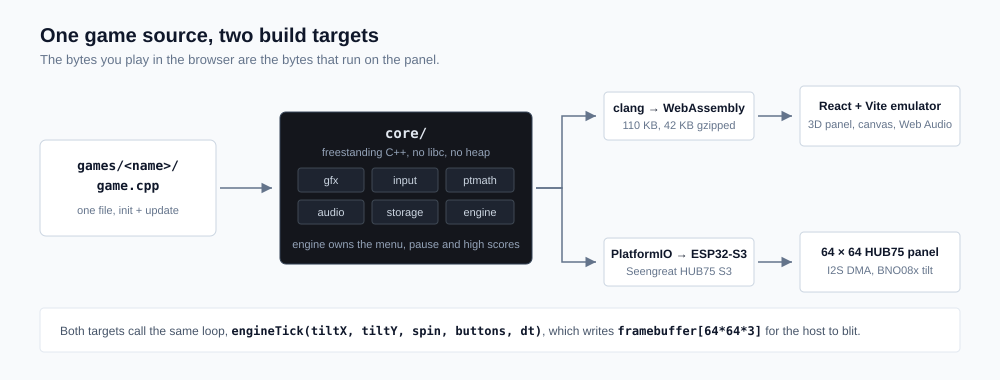
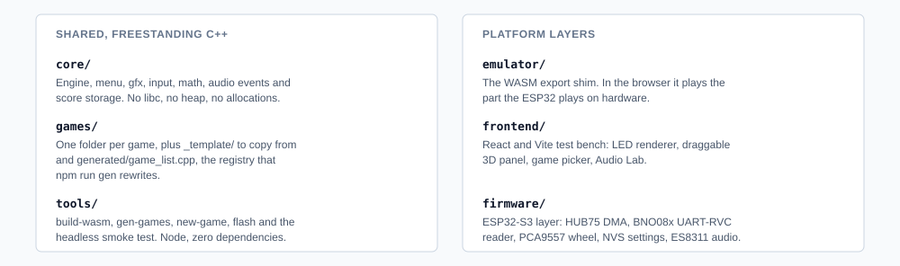

# PixelTilt

An open-source, modular game framework for a tilt-controlled 64×64 LED matrix
handheld built from off-the-shelf parts. Write a game once in about 100 lines
of C++, play it straight away in a browser emulator, then flash the **same
bytes** to the real hardware.



## Hardware

| Part | Buy | Notes |
| --- | --- | --- |
| Seengreat RGB Matrix HUB75 S3 | [Amazon](https://www.amazon.com/dp/B0H69DTZVH) · [Seengreat direct](https://seengreat.com/product/359/rgb-matrix-hub75-s3-esp32-s3-based-led-matrix-controller-board-with-a) | ESP32-S3-WROOM-1-N16R8 controller with a HUB75 port, a 3-way thumb wheel and dual USB-C |
| GY-BNO08x 9-DOF IMU | [Amazon](https://www.amazon.com/dp/B0D2RB2TYC), or [SparkFun BNO086 Qwiic](https://www.amazon.com/dp/B0CG5XXQ5Y) | BNO080/BNO085 breakout with PS0 and PS1 broken out, which is what UART-RVC mode needs |
| 64×64 HUB75 RGB matrix | [Amazon, Waveshare P3](https://www.amazon.com/dp/B0B3F7WKJ1), or [P2.5](https://www.amazon.com/dp/B0BQYFRVTR) | Any 64×64 HUB75 or HUB75E panel works |

### Build

Everything mounts on the back of the panel, and nothing needs soldering as
long as your IMU breakout ships with its header pre-fitted. Besides the parts
above you want five dupont jumper wires for VCC, GND, PS0, PS1 and the
sensor's TX line, foam tape or M2 standoffs for the IMU, and a small
screwdriver for the power terminal.


1. **Panel power first.** Screw the panel's power harness into the board's
   VH-4P 5 V terminal and plug the other end into the panel's power
   connector, at 5 V and 4 A or less. Do this before you seat the board,
   because the terminal is awkward to reach afterwards.
2. **Seat the board on the IN socket.** The board has two HUB75 connectors, a
   box header on top for a ribbon and a pin header on the back for direct
   mounting. They are one port wired in parallel, so "dual HUB75" in the
   listings means these two connectors rather than two channels. Direct
   mounting drops the board straight onto the panel's **IN** socket, the one
   the silkscreen arrows point away from. If the panel stays dark later,
   unplug and re-seat it firmly. A half-seated header is the classic failure.
   Check you are not on the OUT socket, which stays empty on a single-panel
   build.
3. **Mount the IMU mid-panel.** Stick the GY-BNO08x flat against the panel
   back with foam tape or standoffs, square to the panel edges. Tilt is
   measured relative to however it ends up sitting, so getting it straight
   now saves a config tweak later.
4. **Wire the IMU for UART-RVC:** `3V3→VCC`, `GND→GND`, `PS0→3V3`,
   `PS1→GND`, and the sensor's `SDA/MISO/TX` pin to `RX0`, which is GPIO44,
   on the board's bottom header. Match the silkscreen *names* at both ends,
   because pin order differs between breakout revisions. The PS0 and PS1
   straps put the BNO08x in UART-RVC mode, where it streams tilt at 100 Hz
   over plain serial. That beats I2C here, because the BNO08x's I2C clock
   stretching is notoriously unreliable against ESP32-family chips. The
   sensor's SCL/SCK/RX and INT/RST/ADR pins stay unconnected.

   

   Prefer I2C anyway? Strap PS0 and PS1 to GND, wire `SDA→GPIO1` and
   `SCL→GPIO2` on the 4-pin 1 mm header, then set `IMU_USE_UART_RVC` to 0 in
   [`firmware/src/board_config.h`](firmware/src/board_config.h).

5. **Power up.** The main USB-C port powers everything and flashes the
   firmware. The second port, marked Power, can feed the matrix separately if
   your supply is weak. Lay the panel flat and still until the menu appears,
   because tilt zero is captured at boot. Press RESET to re-zero.

If tilt feels rotated once you are in a game, say tilting away moves things
sideways, cycle **Settings → TILT** on the device. It quarter-turns the tilt
mapping to match however the IMU is mounted. If tilt is *mirrored*, with left
and right swapped, toggle **Settings → FLIP**. Between the two, every IMU
mounting is reachable without a reflash. **Settings → SCREEN** rotates the
picture the same way if the panel hangs sideways.

The thumb wheel rolls up, rolls down and presses in. The firmware reads it
through the onboard PCA9557 I2C expander at 0x19, so there is nothing to wire
there. All pin definitions live in
[`firmware/src/board_config.h`](firmware/src/board_config.h) and match
Seengreat's wiki and demo code.

## Quick start, no hardware needed

```sh
npm install
npm run dev        # builds the wasm, starts the emulator at localhost:5173
```

The first build downloads a pinned
[wasi-sdk](https://github.com/WebAssembly/wasi-sdk) into `.toolchain/`, about
100 MB, once. No Emscripten, no CMake, no global compiler install.

Emulator controls, mirroring the hardware:

| Hardware | Emulator |
| --- | --- |
| Tilt, from BNO08x gravity | Arrow keys, or drag the 3D panel |
| Twist or spin, from BNO08x yaw in UART-RVC mode | `Q` and `E`, right-drag, drag near a panel corner, or enable phone sensors |
| Shake, from BNO08x linear acceleration | `Space`, a panel shove, or enable phone sensors and shake the phone |
| Wheel up, click, down | Wheel up, middle-click, wheel down. Also `A`, `S` and `D`, where Enter clicks, or the ▲ ● ▼ buttons |
| Pause menu, in game | Hold `S`. On the device, hold the wheel press for about 0.7 s |

The panel is a 3D object. Left-drag the face to tilt it, right-drag to spin,
and drag with both buttons to slide it. On touchscreens, hold and then drag to
slide. That shove reads as G-force in the sim. Phones with supported motion
APIs also get a **sensors** switch for tilt, spin and linear movement, and it
stays off until you turn it on. The HUD carries a game picker, the wheel, and
music and SFX volume. **music** in the top right opens the Audio Lab.

The panel view simulates the real matrix rather than scaling up a screenshot.
You get individual LED dots with the dark gaps between them, and the panel's
actual color response. [Color on the panel](#color-on-the-panel) covers what
that costs you.

Holding the wheel press in a game opens the pause menu, with **resume**,
**settings** and **main menu**. The main menu also has **SCORES**, a top-3
table per game, and **SETTINGS** for screen rotation in 90° steps, brightness,
SFX and music volume, and a high-score reset. Settings and scores survive
power cycles. The device keeps them in NVS flash and the emulator in
localStorage.

Twenty-two games ship in the repo. **Tilt Maze** rolls a ball to a goal past
holes, **Snake** steers on the dominant tilt axis, **Breakout** maps tilt
straight to paddle position, and the Sand II family below shares one runtime.
**WIZ3** is the complete 19-level port of the original Java runtime. Its level
records, source tile and sprite sheets, and original sound clips live in
`games/wiz3/` and `assets/sounds/wiz3/`. The 64x64 gameplay art is hand-drawn
at final resolution in `games/wiz3/art.h`. Tilt moves, CLICK jumps, UP operates
doors and levers, and DOWN activates the earned invisibility spell. Regenerate
the source assets with `python tools/extract-wiz3-assets.py --jar
wiz3-original.jar` from the creator-hosted JAR, not the reduced HTML remake.

### Sand II family

**Sand II** is the original rainbow granular-physics sandbox. Five related
toys reuse its particle arena and solver but give the material very different
force laws and controls.

| Title | Flavor | Physical controls | Emulator |
| --- | --- | --- | --- |
| **LAVA LAMP** | Hot, buoyant blobs | Tilt and shake, optional spin, wheel up/down sets **HEAT**, tap click resets | Arrows or drag, `Space`, `Q`/`E`, `A`/`D` for HEAT, tap `S` |
| **SNOW GLOBE** | Drifting, turbulent flakes | Tilt and shake, optional spin, wheel up/down sets **WIND**, tap click resets | Arrows or drag, `Space`, `Q`/`E`, `A`/`D` for WIND, tap `S` |
| **STAR FORGE** | Dust orbiting a gravity well | Tilt and shake, optional spin, wheel up/down sets **PULL**, tap click resets | Arrows or drag, `Space`, `Q`/`E`, `A`/`D` for PULL, tap `S` |
| **FERROFLOW** | Grains drawn between magnetic poles | Tilt and shake, optional spin, wheel up/down sets **POLE**, tap click resets | Arrows or drag, `Space`, `Q`/`E`, `A`/`D` for POLE, tap `S` |
| **NEON GAS** | Fast, luminous particles | Tilt and shake, optional spin, wheel up/down sets **POWER**, tap click resets | Arrows or drag, `Space`, `Q`/`E`, `A`/`D` for POWER, tap `S` |

Tap actions fire on a short click release. Holding the wheel press for about
0.7 seconds still opens the pause menu without also resetting the toy, and
holding `S` does the same in the emulator. The six menu entries share one
fixed simulation workspace and compact flavor profiles, so they do not
multiply Sand II's RAM or per-frame solver budget.

The emulator plays the games' sound effects and background music through Web
Audio. Press any key or click once to satisfy the browser's autoplay gate. The
**music** link in the top right opens the Audio Lab, a browser for the core's
programmatic SFX banks with an MP3 to PTA converter alongside it. PTA is this
project's tiny mono ADPCM format. Pick a sample rate and codec, preview the
result, check the output size, then download the file or assign it as a
background-music track. Assigning only changes the browser. To put a song on
the device, save the downloaded file as `assets/music/<track>.pta`, where the
track is menu, chill, action or tense, and reflash. The firmware build embeds
it. See [`assets/music/README.md`](assets/music/README.md).

## Flash the device

```sh
npm run flash                  # auto-detects the S3, builds, uploads
npm run flash -- --monitor     # same, then opens the serial console
npm run flash -- --port COM7   # pin a specific port
npm run monitor                # serial console at 115200
```

The flasher looks after itself. It offers to `pip install platformio` if that
is missing, scans serial ports for the S3 by Espressif's native USB id, asks
before using an ambiguous port, walks you through BOOT and RESET if an upload
fails, and finishes with a RAM and flash usage report:

```
------------------------------------------------------------------------
  FLASHED OK -> COM10
  RAM    [##..................]  10.8%   35,400 / 327,680 bytes
  Flash  [#...................]   5.1%   331,197 / 6,553,600 bytes
------------------------------------------------------------------------
```

The firmware boots into the same menu you see in the emulator. Wheel to
navigate, press to launch. Tilt zero is captured at boot, so leave the device
resting until the menu appears, and press RESET to re-zero.

## Write a game

```sh
npm run new-game -- space_dodge "SPACE DODGE"
```

That scaffolds `games/space_dodge/game.cpp` from the annotated template and
registers it. Run `npm run dev` and it is already in the menu. A game is one
file:

```cpp
#include "pixeltilt/pixeltilt.h"
using namespace pt;

namespace {
float x;

void init() { x = 32; }                    // runs on every launch

void update(float dt) {                    // runs every frame
  x += input.tiltX * 40.0f * dt;           // tilt is [-1, 1]
  if (input.justDown(BTN_CLICK)) x = 32;   // wheel press
  clear();
  fillCircle((int)x, 32, 3, hsv(x * 4, 0.9f, 1.0f));
}
}  // namespace

PT_GAME(space_dodge, "SPACE DODGE", init, update)
```

The API lives in [`core/include/pixeltilt/`](core/include/pixeltilt):

- **`gfx.h`** draws into a 64×64 RGB888 framebuffer with `clear`, `pixel`,
  `line`, `rect`, `fillRect`, `circle`, `fillCircle`, and `text` and
  `textCentered` in a 3×5 font. Colors come from `rgb()` and `hsv()`.
- **`input.h`** gives you `input.tiltX` and `input.tiltY` in [-1, 1], plus
  `input.spin`, the twist rate about the screen normal in rad/s where positive
  is clockwise. Spin comes from the UART-RVC yaw field on hardware and from
  `Q` and `E` in the emulator, and reads 0 where it is unavailable. `held`,
  `justDown` and `justUp` cover `BTN_UP`, `BTN_CLICK` and `BTN_DOWN`.
- **`ptmath.h`** carries `sinf_`, `cosf_`, `sqrtf_`, `atan2f_`, `clampf`,
  `lerpf`, `tiltCurve` for deadzone and response shaping on analog tilt, and a
  deterministic RNG in `randRange` and `randf`. Games use these instead of
  `<math.h>` so the same source compiles freestanding for both WASM and the
  ESP32.
- **`audio.h`** fires a one-shot with `sfx(SFX_COIN)` from the game's sound
  bank, which holds 12 events across 4 style banks: `STYLE_ARCADE`,
  `STYLE_CHIP`, `STYLE_SOFT` and `STYLE_GRIT`, picked with `setSfxStyle()` in
  `init()`. A second argument pitches the sound, as in `sfx(SFX_COIN, 1.5f)`.
  `music(MUS_CHILL/ACTION/TENSE)` requests background music by mood. The core
  only records these as data events, and each platform host renders them: Web
  Audio in the emulator, and an ES8311 I2S task on the device that ports the
  same synth math.
- **`storage.h`** takes `submitScore(value)` when a run ends, and the engine
  keeps a persistent top 3 for that game. It returns 0 for a new best, which
  is handy for a "NEW BEST!" flash. Points are the default. Register with
  `PT_GAME_SCORED(..., pt::SCORE_TIME)` for lower-is-better times in
  deciseconds, or `pt::SCORE_LEVEL` for highest level reached.

Rules of the road: no heap, no static constructors, keep state in plain
globals and reset it in `init()`. The engine owns the menu and the hold-CLICK
pause menu, so games never handle either. Just avoid gameplay that needs you
to hold the wheel press.

### Color on the panel

You write RGB888, but the panel is a long way from a 24-bit display, and the
gap is big enough to design around. On the device each channel goes through
the HUB75 driver's CIE 1931 lightness curve before it becomes an 8-bit
binary-coded-modulation duty cycle, and that curve spends its resolution at
the top, where the eye can use it.

| What you write | What the panel does |
| --- | --- |
| 256 codes per channel | **174** distinct light levels |
| codes 0 to 4 | off, indistinguishable from black |
| codes 0 to 63, the bottom quarter | **12** levels in total |
| code 128, mid grey | 18 % of full light |
| code 255 | full, and *very* bright up close |

So, in practice:

- **Nothing subtle survives in the shadows.** `rgb(3,3,3)` is black, and
  `rgb(20,20,20)` and `rgb(24,24,24)` are the same pixel. If two dark things
  must read as different, separate them by about 16 codes down there, not 2.
- **Dim by hue, not by value.** A dark-blue background at `v=0.1` is either
  invisible or one flat block. A saturated hue at `v=0.35` still reads as
  color.
- **Ramps band at the bottom.** A 64-pixel gradient from black gets about 12
  steps in its first quarter, so fades and soft shadows show contours. Dither,
  or start the ramp above code 64.
- **Saturated primaries win.** The LEDs are narrow-band emitters, so pure red,
  green, blue, cyan, magenta and yellow are brilliant, while pastels and
  near-greys wash out into dim white from a metre away.
- **One pixel is one LED.** With roughly 1 mm dies on a 3 mm pitch there is no
  anti-aliasing to hide behind. Single-pixel detail reads as a dot, and thin
  diagonal lines shimmer.
- **Brightness scales all of it.** The brightness setting shortens the drive
  time, which dims the emitted light linearly, so a picture that only just
  works at 100 % disappears at 30 %.

The emulator reproduces that pipeline: the same CIE table the firmware's panel
library uses, then the brightness setting, then round LED dots on a black mask
with the real gap between them, pushed toward the panel's narrow-band-primary
look because sRGB cannot show how pure these LEDs are. It all lives in
[`frontend/src/emulator/panel.ts`](frontend/src/emulator/panel.ts). What
crushes to black in the browser crushes to black on the hardware, so the bench
is a fair place to pick colors.

## Repo layout



Both platforms drive the identical core loop. `engineTick(tiltX, tiltY, spin,
buttons, dt)` runs the game, the game draws into a shared
`framebuffer[64*64*3]`, and the platform blits it, by DMA to the panel or to a
canvas in the browser.

`npm test` compiles the wasm and runs a headless smoke test that boots the
engine, launches every registered game and feeds it 300 frames of input. CI
runs it too, so a broken game cannot land silently.

## License

MIT
