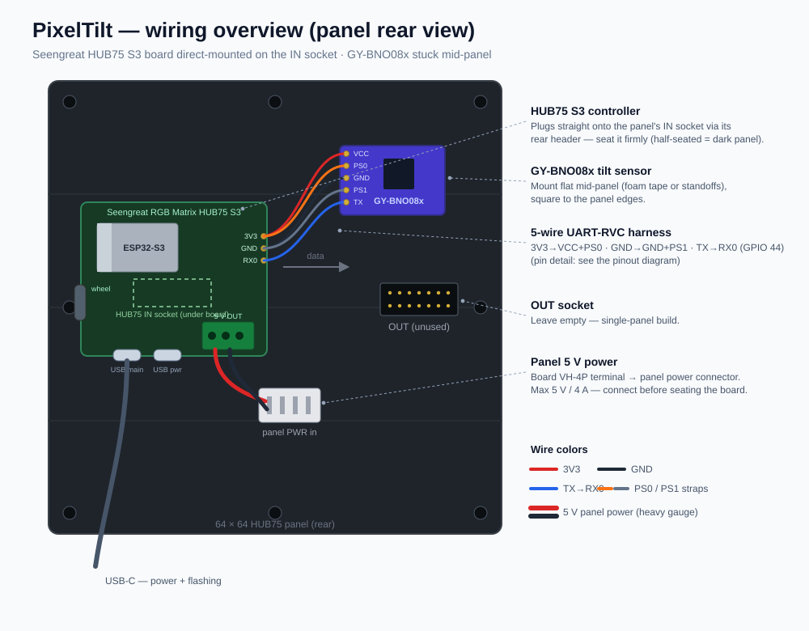
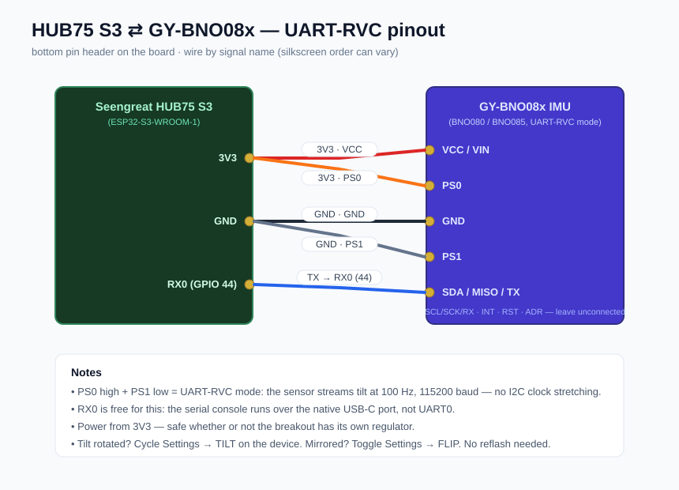

# PixelTilt

An open-source, modular game framework for a tilt-controlled 64×64 LED matrix
handheld built from off-the-shelf parts. Write a game once in ~100 lines of
C++, play it instantly in a browser emulator, then flash the **same bytes** to
the real hardware.

```
┌───────────────┐        ┌──────────────────────────────────────────┐
│  games/*/     │        │ core/  (freestanding C++ — no libc)      │
│  game.cpp     ├───────►│ gfx · input · math · engine + menu       │
└───────────────┘        └───────────┬──────────────────┬───────────┘
                                     │                  │
                         clang → WASM (18 KB)    PlatformIO → ESP32-S3
                                     │                  │
                          React/Vite emulator     HUB75 panel + BNO08x
```

## Hardware

| Part | Buy | Notes |
| --- | --- | --- |
| Seengreat RGB Matrix HUB75 S3 | [Amazon](https://www.amazon.com/dp/B0H69DTZVH) · [Seengreat direct](https://seengreat.com/product/359/rgb-matrix-hub75-s3-esp32-s3-based-led-matrix-controller-board-with-a) | ESP32-S3-WROOM-1-N16R8 controller with HUB75 port, 3-way thumb wheel, dual USB-C |
| GY-BNO08x 9-DOF IMU | [Amazon](https://www.amazon.com/dp/B0D2RB2TYC) (or [SparkFun BNO086 Qwiic](https://www.amazon.com/dp/B0CG5XXQ5Y)) | BNO080/BNO085 breakout with PS0/PS1 pins broken out (UART-RVC mode) |
| 64×64 HUB75 RGB matrix | [Amazon — Waveshare P3](https://www.amazon.com/dp/B0B3F7WKJ1) (or [P2.5](https://www.amazon.com/dp/B0BQYFRVTR)) | Any 64×64 HUB75/HUB75E panel works |

### Build

Everything mounts on the back of the panel — no soldering if your IMU
breakout ships with its header pre-fitted. Besides the parts above you'll
want five dupont jumper wires (for VCC, GND, PS0, PS1 and the sensor's TX
line), foam tape or M2 standoffs for the IMU, and a small screwdriver for
the power terminal.



1. **Panel power first.** Screw the panel's power harness into the board's
   VH-4P 5 V terminal and plug the other end into the panel's power
   connector (max 5 V/4 A). Do this *before* seating the board — the
   connector is awkward to reach afterwards.
2. **Seat the board on the IN socket.** The board's two HUB75 connectors
   (top box header for a ribbon, back pin header for direct plug-in) are
   the *same* port wired in parallel — "dual HUB75" in the listings means
   these two, not two channels. Direct-mount plugs the board straight onto
   the panel's **IN** socket (the one the silkscreen arrows point away
   from). If the panel stays dark later, unplug and firmly re-seat — a
   half-seated header is the classic failure — and make sure you're not on
   the OUT socket. OUT stays empty on a single-panel build.
3. **Mount the IMU mid-panel.** Stick the GY-BNO08x flat against the panel
   back with foam tape (or standoffs), square to the panel edges — tilt is
   measured relative to however it sits, so straight now saves a config
   tweak later.
4. **Wire the IMU (UART-RVC):** `3V3→VCC`, `GND→GND`, `PS0→3V3`,
   `PS1→GND`, and the sensor's `SDA/MISO/TX` pin `→RX0` (GPIO44) on the
   board's bottom header. Match the silkscreen *names* on both ends — pin
   order can differ between breakout revisions. The PS0/PS1 straps put the
   BNO08x in UART-RVC mode, where it streams tilt at 100 Hz over plain
   serial — chosen over I2C because the BNO08x's I2C clock stretching is
   notoriously unreliable against ESP32-family chips. The sensor's
   SCL/SCK/RX and INT/RST/ADR pins stay unconnected.

   

   *(Prefer I2C anyway? Strap PS0 and PS1 to GND, wire `SDA→GPIO1`,
   `SCL→GPIO2` on the 4-pin 1 mm header, and set `IMU_USE_UART_RVC` to 0 in
   [`firmware/src/board_config.h`](firmware/src/board_config.h).)*

5. **Power up.** The main USB-C port powers everything and flashes the
   firmware (the second "Power" USB-C can feed the matrix separately if
   your supply is weak). Lay the panel flat and still until the menu
   appears — tilt zero is captured at boot; press RESET to re-zero.

If tilt feels rotated once you're in a game (e.g. tilting away moves things
sideways), cycle **Settings → TILT** on the device — it quarter-turns the
tilt mapping to match however the IMU is mounted. If tilt is *mirrored*
(left/right swapped), toggle **Settings → FLIP**. Between the two, every
IMU mounting is reachable without a reflash. **Settings → SCREEN** likewise
rotates the picture if the panel hangs sideways.
The thumb wheel (up / press / down) is read through the onboard PCA9557 I2C
expander at 0x19 — already handled by the firmware. All pin definitions live
in [`firmware/src/board_config.h`](firmware/src/board_config.h) and match
Seengreat's wiki and demo code.

## Quick start (no hardware needed)

```sh
npm install
npm run dev        # builds the wasm, starts the emulator at localhost:5173
```

The first build downloads a pinned [wasi-sdk](https://github.com/WebAssembly/wasi-sdk)
into `.toolchain/` (~100 MB, one time). No Emscripten, no CMake, no global
compiler install.

**Emulator controls** (mirroring the hardware):

| Hardware | Emulator |
| --- | --- |
| Tilt (BNO08x gravity) | Arrow keys, or drag the tilt pad |
| Twist / spin (BNO08x yaw, UART-RVC mode) | `Q` / `E` |
| Wheel up / click / down | `A` / `S` / `D` (Enter also clicks) |
| Pause menu (in game) | hold `S` (device: hold wheel press ~0.7 s) |

Holding the wheel press in a game opens the pause menu: **resume**, **settings**
or **main menu**. The main menu also has **SCORES** (top-3 table per game) and
**SETTINGS** — screen rotation in 90° steps, brightness, SFX and music
volume, and a high-score reset. Settings and scores persist across power
cycles: NVS flash on the device, localStorage in the emulator.

The emulator plays the games' sound effects and background music through Web
Audio (press any key/click once to satisfy the browser's autoplay gate). The
**AUDIO LAB** page (top-right nav) has two extras: a browser for the core's
programmatic SFX banks, and an **MP3 → PTA converter** — PTA is the project's
tiny mono ADPCM format (pick sample rate and codec, preview the result, see
the output size, download the file or assign it as a background-music track).
Assigning affects the browser; to put a song on the device, save the
downloaded file as `assets/music/<track>.pta` (menu/chill/action/tense) and
reflash — the firmware build embeds it (see `assets/music/README.md`).

## Flash the device

```sh
npm run flash                  # auto-detects the S3, builds, uploads
npm run flash -- --monitor     # same, then opens the serial console
npm run flash -- --port COM7   # pin a specific port
npm run monitor                # serial console at 115200
```

The flasher is self-sufficient: it offers to `pip install platformio` if it's
missing, scans serial ports for the S3 (Espressif's native USB id), asks
before using an ambiguous port, walks you through BOOT+RESET if an upload
fails, and finishes with a RAM/Flash usage report:

```
------------------------------------------------------------------------
  FLASHED OK -> COM10
  RAM    [##..................]  10.8%   35,400 / 327,680 bytes
  Flash  [#...................]   5.1%   331,197 / 6,553,600 bytes
------------------------------------------------------------------------
```

The firmware boots into the same menu you see in the emulator: wheel to
navigate, press to launch. Tilt zero is captured at boot (leave the device
resting until the menu appears; press RESET to re-zero).

## Write a game

```sh
npm run new-game -- space_dodge "SPACE DODGE"
```

That scaffolds `games/space_dodge/game.cpp` from the annotated template and
registers it. `npm run dev` and it's already in the menu. A game is one file:

```cpp
#include "pixeltilt/pixeltilt.h"
using namespace pt;

namespace {
float x;

void init() { x = 32; }                    // runs on every launch

void update(float dt) {                    // runs every frame
  x += input.tiltX * 40.0f * dt;           // tilt is [-1, 1]
  if (input.justDown(BTN_CLICK)) x = 32;   // wheel press
  clear();
  fillCircle((int)x, 32, 3, hsv(x * 4, 0.9f, 1.0f));
}
}  // namespace

PT_GAME(space_dodge, "SPACE DODGE", init, update)
```

The API (see [`core/include/pixeltilt/`](core/include/pixeltilt)):

- **`gfx.h`** — 64×64 RGB888 framebuffer: `clear`, `pixel`, `line`, `rect`,
  `fillRect`, `circle`, `fillCircle`, `text`/`textCentered` (3×5 font),
  colors via `rgb()` / `hsv()`.
- **`input.h`** — `input.tiltX/.tiltY` in [-1, 1]; `input.spin` — twist rate
  about the screen normal in rad/s (+ = clockwise; yaw from the UART-RVC
  stream on hardware, `Q`/`E` in the emulator, 0 when unavailable); `held` /
  `justDown` / `justUp` for `BTN_UP`, `BTN_CLICK`, `BTN_DOWN`.
- **`ptmath.h`** — `sinf_`, `cosf_`, `sqrtf_`, `atan2f_`, `clampf`, `lerpf`,
  `tiltCurve` (deadzone + response shaping for analog tilt control),
  deterministic RNG (`randRange`, `randf`). Games use these instead of
  `<math.h>` so the exact same code compiles freestanding for WASM and for
  the ESP32.
- **`audio.h`** — `sfx(SFX_COIN)` fires a one-shot from the game's sound bank
  (12 events × 4 style banks: `STYLE_ARCADE/CHIP/SOFT/GRIT`, picked with
  `setSfxStyle()` in `init()`); an optional second arg pitches the sound
  (`sfx(SFX_COIN, 1.5f)`). `music(MUS_CHILL/ACTION/TENSE)` requests
  background music by mood. The core only records these as data events —
  each platform host renders them (Web Audio in the emulator; the ESP32
  driver can consume the same ring buffer when the board's codec is wired).
- **`storage.h`** — call `submitScore(value)` when a run ends and the engine
  keeps a persistent top-3 for the game (returns 0 for a new best — nice for
  a "NEW BEST!" flash). Points are the default; register with
  `PT_GAME_SCORED(..., pt::SCORE_TIME)` for lower-is-better times in
  deciseconds, or `pt::SCORE_LEVEL` for highest-level-reached.

Rules of the road: no heap, no static constructors, keep state in plain
globals and reset it in `init()`. The engine owns the menu and the hold-CLICK
pause menu — games never need to handle either (just avoid gameplay that
requires holding the wheel press).

Ships with three examples: **Tilt Maze** (roll to the goal, avoid holes),
**Snake** (dominant tilt axis steers), **Breakout** (tilt = paddle position).

## Repo layout

```
core/       engine, gfx, input, math — shared, freestanding C++
games/      one folder per game + _template/ + generated/ registry
emulator/   WASM export shim (the browser "hardware")
frontend/   React + Vite test bench (LED renderer, tilt pad, game registry)
firmware/   ESP32-S3 platform layer (HUB75 DMA, BNO08x, PCA9557 keys)
tools/      build-wasm, gen-games, new-game, smoke-test (Node, zero deps)
```

Both platforms drive the identical core loop:
`engineTick(tiltX, tiltY, spin, buttons, dt)` → game draws into a shared
`framebuffer[64*64*3]` → platform blits it (DMA to the panel, or canvas in
the browser).

`npm test` compiles the wasm and runs a headless smoke test that boots the
engine, launches every registered game, and feeds it 300 frames of input —
also run in CI, so a broken game can't land silently.

## License

MIT
